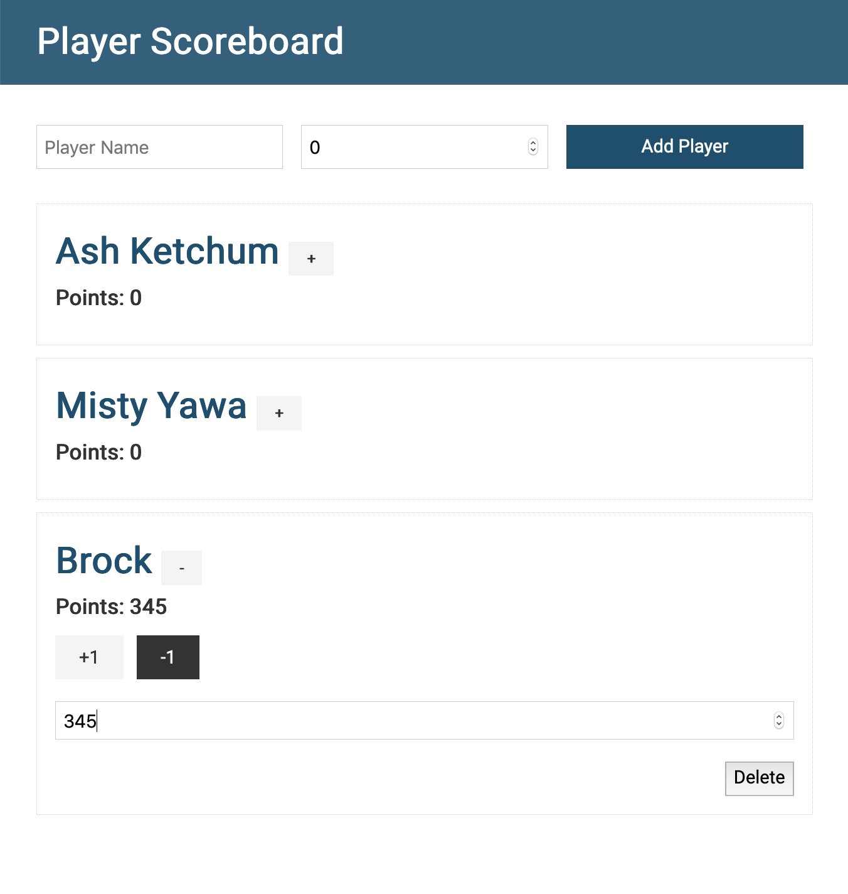

# svelte-scoreboard
"Svelte is a radical new approach to building user interfaces. Whereas traditional frameworks like React and Vue do the bulk of their work in the browser, Svelte shifts that work into a compile step that happens when you build your app.

Instead of using techniques like virtual DOM diffing, Svelte writes code that surgically updates the DOM when the state of your app changes." - from https://svelte.dev/
- Following Traversy Media's tutorial *Svelte Crash Course*: https://www.youtube.com/watch?v=uK2RnIzrQ0M&feature=youtu.be
- Updates: 
    1) Added data-binding to player points prop, so that points would not reset whenever a new player was added.
    2) Added `unNamedPlayerNamer()` function which auto-names a new player with no name input (Player 1, Player 2, Player 3, ...)
    3) Improved styling of delete player button

- Recommended VSCode Extension: Svelte

---
---
---

*Looking for a shareable component template? Go here --> [sveltejs/component-template](https://github.com/sveltejs/component-template)*

---

## svelte app

This is a project template for [Svelte](https://svelte.dev) apps. It lives at https://github.com/sveltejs/template.

To create a new project based on this template using [degit](https://github.com/Rich-Harris/degit):

```bash
npx degit sveltejs/template svelte-app
cd svelte-app
```

*Note that you will need to have [Node.js](https://nodejs.org) installed.*


## Get started

Install the dependencies...

```bash
cd svelte-app
npm install
```

...then start [Rollup](https://rollupjs.org):

```bash
npm run dev
```

Navigate to [localhost:5000](http://localhost:5000). You should see your app running. Edit a component file in `src`, save it, and reload the page to see your changes.

By default, the server will only respond to requests from localhost. To allow connections from other computers, edit the `sirv` commands in package.json to include the option `--host 0.0.0.0`.


## Building and running in production mode

To create an optimised version of the app:

```bash
npm run build
```

You can run the newly built app with `npm run start`. This uses [sirv](https://github.com/lukeed/sirv), which is included in your package.json's `dependencies` so that the app will work when you deploy to platforms like [Heroku](https://heroku.com).


## Single-page app mode

By default, sirv will only respond to requests that match files in `public`. This is to maximise compatibility with static fileservers, allowing you to deploy your app anywhere.

If you're building a single-page app (SPA) with multiple routes, sirv needs to be able to respond to requests for *any* path. You can make it so by editing the `"start"` command in package.json:

```js
"start": "sirv public --single"
```


## Deploying to the web

### With [now](https://zeit.co/now)

Install `now` if you haven't already:

```bash
npm install -g now
```

Then, from within your project folder:

```bash
cd public
now deploy --name my-project
```

As an alternative, use the [Now desktop client](https://zeit.co/download) and simply drag the unzipped project folder to the taskbar icon.

### With [surge](https://surge.sh/)

Install `surge` if you haven't already:

```bash
npm install -g surge
```

Then, from within your project folder:

```bash
npm run build
surge public my-project.surge.sh
```
